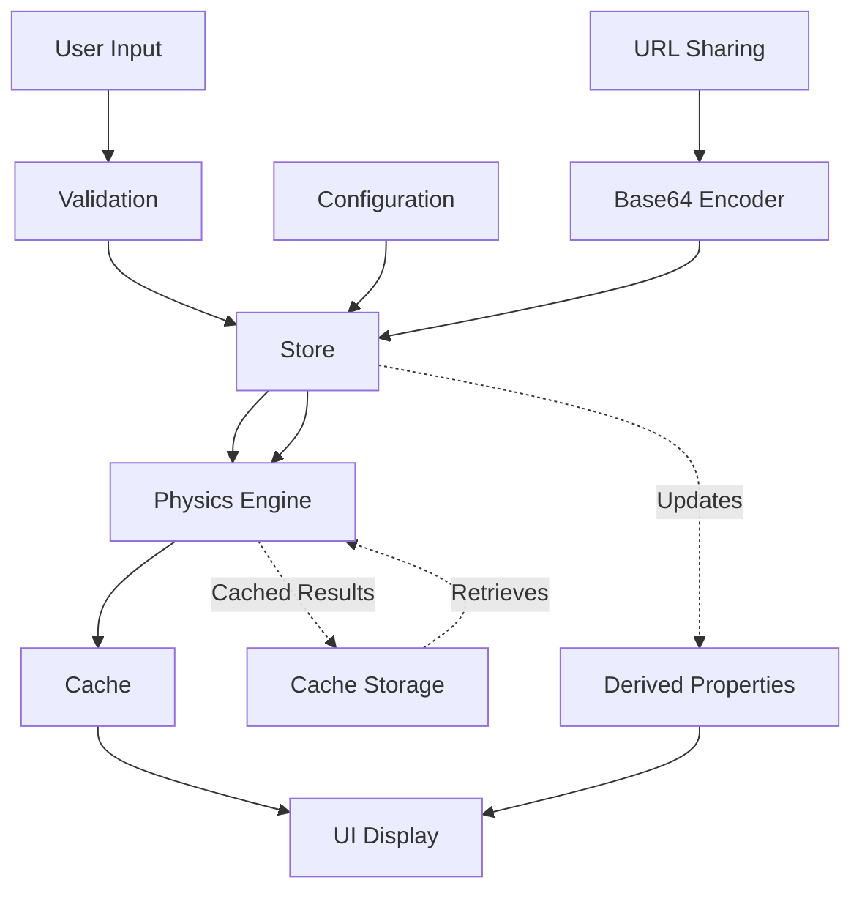

# Architecture Documentation

## System Overview

The EV Scooter Calculator is a single-page application built with SvelteKit, using reactive state management (Svelte 5 runes) for real-time calculations.

## Data Flow



## Core Components

### Physics Engine (`lib/utils/physics.ts`)
- Pure functional calculations
- LRU cache for performance (200-entry limit with intelligent eviction)
- Temperature modeling (linear interpolation -20°C to 20°C)
- Drag and hill climb physics
- Optimized O(1) and O(log n) calculations

#### Key Functions:
- `calculatePerformance()`: Main entry point, returns comprehensive performance stats
- `calculateDragLimitedSpeed()`: Solves cubic equation for equilibrium speed (O(1))
- `calculateHillSpeed()`: Uses binary search for hill climbing speed (O(log n))
- `calculateTemperatureFactor()`: Models battery efficiency across temperature range
- `detectBottlenecks()`: Identifies system limitations
- `generateRecommendations()`: Suggests upgrades based on config
- `simulateUpgrade()`: Creates modified config for upgrade simulation
- `calculateUpgradeDelta()`: Calculates before/after performance differences

#### Performance Optimizations:
1. **Drag Speed**: Replaced linear iteration with cubic root solution (10-100x faster)
2. **Hill Speed**: Replaced linear iteration with binary search (O(log n) complexity)
3. **LRU Cache**: Implemented intelligent cache with MRU eviction
4. **Caching Strategy**: Cache key includes all config parameters for correctness

### State Management (`lib/stores/`)
- `calculator.svelte.ts`: Main calculator state
- `profiles.svelte.ts`: User profiles persistence
- Uses Svelte 5 runes ($state, $derived)

#### Calculator Store Structure:
```typescript
interface CalculatorState {
  // Configuration
  config: ScooterConfig;
  
  // UI State
  showAdvanced: boolean;
  compareMode: boolean;
  predictionMode: 'spec' | 'realworld';
  activeTab: 'configuration' | 'upgrades';
  
  // Simulation
  simulatedConfig: ScooterConfig | null;
  activeUpgrade: 'parallel' | 'voltage' | 'controller' | 'motor' | 'tires' | null;
  rideMode: 'eco' | 'normal' | 'sport' | 'turbo';
  
  // Computed Properties (Derived)
  stats: PerformanceStats;
  simStats: PerformanceStats | null;
  bottlenecks: Bottleneck[];
  recommendations: Recommendation[];
  upgradeDelta: UpgradeDelta | null;
}
```

#### Actions:
- `applyConfig()`: Updates configuration with normalization
- `loadPreset()`: Loads preset from presets.ts
- `updateConfig()`: Updates specific configuration field
- `simulateUpgrade()`: Creates upgrade simulation
- `clearSimulation()`: Clears upgrade state
- `applyRideMode()`: Applies eco/normal/sport/turbo presets
- `createShareLink()` / `loadConfigFromUrl()`: URL sharing via Base64 encoding

### UI Components
- `calculator/`: Domain-specific calculator components
  - `BasicConfig.svelte`: Primary inputs (voltage, capacity, motors, power)
  - `AdvancedConfig.svelte`: Secondary inputs (weight, temperature, efficiency, etc.)
  - `PerformanceSummary.svelte`: Main metrics display with grade
  - `PowerGraph.svelte`: Visual power curve
  - `UpgradeSimulator.svelte`: Upgrade selection UI
  - `ComparisonDisplay.svelte`: Side-by-side upgrade comparison
  - `UpgradeGuidance.svelte`: Upgrade recommendations
  - `ProfileManager.svelte`: Save/load user configurations
  
- `ui/`: Reusable UI primitives
  - `Tabs.svelte`: Tab navigation with keyboard support
  - `Card.svelte`: Generic card container
  - `StatsCard.svelte`: Metric display
  - `NumberInput.svelte`: Numeric input with validation and debouncing
  - `Toast.svelte`: Notification system
  - `Hero.svelte`: Landing section
  - `TourModal.svelte`: Guided onboarding
  - `ConfirmDialog.svelte`: Confirmation dialogs
  - `LoadingSkeleton.svelte`: Loading states

## Key Design Decisions

### 1. Performance over precision
- **Decision**: Linear approximation for temperature curves
- **Rationale**: Sufficient accuracy for scooter calculations, significantly faster than exponential/lookup table approaches
- **Impact**: Temperature calculation is O(1), maintains ±5% accuracy within operational range

### 2. Safety over convenience
- **Decision**: Strict validation on all inputs
- **Rationale**: Prevents invalid states, provides clear feedback
- **Impact**: All inputs validated against [min, max] ranges with user-friendly messages

### 3. Reactivity over explicit updates
- **Decision**: Use Svelte 5 derived properties for computed values
- **Rationale**: Automatic updates when dependencies change, less boilerplate
- **Impact**: Performance stats auto-update when config changes, no manual refresh needed

### 4. Caching strategy
- **Decision**: LRU cache with 200-entry limit
- **Rationale**: Balances memory usage with performance for interactive use
- **Impact**: Subsequent identical calculations are O(1), cache evicts intelligently
- **Implementation**: Custom LRUCache class re-inserts accessed entries to maintain recency order

### 5. Physics accuracy
- **Decision**: Apply temperature factor to both battery capacity AND motor power
- **Rationale**: Physically accurate - cold temperatures affect both energy storage and discharge rate
- **Architecture Reference**: [`.automaker/memory/architecture.md`](.automaker/memory/architecture.md)
- **Impact**: Realistic modeling for extreme temperature conditions

### 6. Error handling
- **Decision**: Comprehensive error logging with context
- **Rationale**: Better debugging, production-ready error tracking
- **Impact**: Errors logged with component, action, config context, timestamp

## Physics Calculations

### Maximum Speed Calculation
```
For motors with KV rating:
  Speed (km/h) = (Motor RPM * Wheel Circumference * 60) / 1000 * Efficiency
  Where Motor RPM = KV * Voltage
  Wheel Circumference = Wheel Size (inches) * 0.0254 * π

For motors without KV:
  Speed (km/h) = (Voltage / 52) * 75
```

### Drag-Limited Speed (Optimized O(1))
```
Power Available = Total Power - Rolling Resistance (15W)
Equilibrium Speed (m/s) = cbrt(2 * Power Available / (Air Density * Drag Coefficient))
Top Speed (km/h) = min(Equilibrium Speed * 3.6, Motor Max Speed)
```

### Hill Climb Speed (Optimized O(log n))
```
Slope Angle = atan(Slope % / 100)
Gravity Force = Total Weight * 9.81 * sin(Slope Angle)

Binary Search for Hill Speed:
  Search for speed where Power Available = Drag + Gravity + Rolling Resistance
  20 iterations provides ±0.1 km/h precision
```

### Range Calculation
```
Effective Capacity (Ah) = Rated Capacity * Battery Health * Temperature Factor
Total Energy (Wh) = Voltage * Effective Capacity
Base Range (km) = Total Energy / Consumption Rate
Regen Gain = Base Range * Regen Efficiency * 0.2
Total Range = Base Range + Regen Gain
```

### Acceleration Score
```
Scooter Weight (kg) = (Total Energy * 0.06) + 15
Total Weight = Scooter Weight + Rider Weight
Effective Power (W) = Motor Power * Voltage Factor * Temperature Factor
Power-to-Weight Ratio = Effective Power / Total Weight
Acceleration Score = min(100, (Power-to-Weight / 25) * 100)
```

### C-Rate
```
Peak Current (A) = Effective Power / Voltage
C-Rate = Peak Current / Effective Capacity

High C-Rate (>3C): Voltage sag warning, suggests parallel battery
```

## Configuration Schema

### ScooterConfig
```typescript
{
  // Core electrical
  v: number;              // Battery voltage (24-96V)
  ah: number;             // Battery capacity (5+ Ah)
  motors: number;          // Motor count (1-4)
  watts: number;           // Power per motor (250+ W)
  controller?: number;      // Controller amp limit (30-100A, optional)
  
  // Mechanical
  weight: number;          // Rider weight (50-150 kg)
  wheel: number;           // Wheel size (8-13 inches)
  motorKv?: number;        // Motor KV rating (20-200 rpm/V, optional)
  scooterWeight?: number;   // Scooter weight (5-100 kg, optional)
  drivetrainEfficiency?: number; // Drivetrain efficiency (0.6-0.95, optional)
  
  // Usage
  style: number;           // Consumption rate (20-80 Wh/km)
  charger: number;        // Charger amps (2-10A)
  regen: number;           // Regen efficiency (0-0.15)
  cost: number;           // Electricity cost ($0.05+/kWh)
  slope: number;           // Hill slope % (0-100%)
  ridePosition: number;    // Drag coefficient (0.4-0.6)
  soh: number;            // Battery health (0.5-1.0)
  ambientTemp: number;     // Temperature (°C, -20 to 50)
  
  // Metadata
  id?: number;            // Profile ID
  name?: string;          // Profile name
}
```

### Prediction Modes
- **'spec'**: Ideal conditions, 100% efficiency factors
- **'realworld'**: Conservative estimate, 85% efficiency, additional battery sag (5% minimum)

## Ride Modes
- **'eco'**: 18 Wh/km consumption, 12% regen, max 20 km/h, 50% power
- **'normal'**: 24 Wh/km consumption, 8% regen, max 35 km/h, 75% power
- **'sport'**: 32 Wh/km consumption, 5% regen, max 50 km/h, 90% power
- **'turbo'**: 42 Wh/km consumption, 3% regen, max 70 km/h, 100% power

## Bottleneck Detection

### High C-Rate Warning
- **Trigger**: C-Rate > 3.0
- **Message**: Battery discharge is too high, expect voltage sag
- **Recommendation**: Add parallel battery

### Controller Limit
- **Trigger**: Controller amps < (Total Power / Voltage)
- **Message**: Controller amp limit is restricting motor power output
- **Recommendation**: High-amp controller

### Gear Ratio Limitation
- **Trigger**: Speed < 45 km/h AND Voltage > 48V AND Acceleration Score < 50
- **Message**: Low speed suggests gear ratio limitation, not voltage
- **Recommendation**: Voltage boost

### Hill Climb Limitation
- **Trigger**: Hill speed < 10 km/h AND Slope > 5%
- **Message**: Poor hill climbing performance, more power or gearing needed
- **Recommendation**: Voltage boost

## Upgrade Simulation

### Upgrade Types
1. **Parallel Battery**: Doubles Ah capacity, halves C-rate
2. **Voltage Boost**: +20% voltage, increases RPM and torque
3. **High-Amp Controller**: Removes controller limit
4. **Dual Motors**: Adds second motor, increases power
5. **Low-Rolling Tires**: Increases efficiency, reduces consumption

### Delta Calculations
- Computes difference in all performance metrics
- Shows percentage and absolute changes
- Supports both spec and realworld modes

## Performance Metrics

### Primary Metrics
- **Range (km)**: Estimated distance on single charge
- **Top Speed (km/h)**: Maximum speed on flat terrain
- **Hill Speed (km/h)**: Maximum speed on specified slope
- **Acceleration Score (/100)**: Power-to-weight based 0-100 scale
- **Running Cost ($/100km)**: Electricity cost per 100km

### Secondary Metrics
- **Total Energy (Wh)**: Battery capacity adjusted for health and temperature
- **Peak Power (W)**: Total motor power output
- **Charge Time (h)**: Time to full charge with 20% overhead
- **Current Draw (A)**: Peak amperage from motors
- **C-Rate**: Battery discharge rate relative to capacity

## Constants

### Physical Constants
- `AIR_DENSITY_KG_M3 = 1.225` (kg/m³)
- `GRAVITY_M_S2 = 9.81` (m/s²)
- `ROLLING_RESISTANCE_WATTS = 15` (W)
- `NOMINAL_VOLTAGE = 52` (V)

### Cache Constants
- `PERFORMANCE_CACHE_LIMIT = 200` (entries)

### UI Constants
- `TOAST_DURATION_MS = 3000`
- `DEBOUNCE_DELAY_MS = 100`
- `MODAL_Z_INDEX = 50`
- `SWIPE_THRESHOLD_PX = 50`
- `MIN_TOUCH_TARGET_SIZE_PX = 44`
- `POWER_GRAPH_HEIGHT_PX = 300`

## Testing Strategy

### Unit Tests
- Physics calculations (optimal values, edge cases)
- Validators (range checking, normalization)
- Formatters (formatting functions)
- Performance benchmarks (cache efficiency)
- Integration tests (store actions, preset loading)

### E2E Tests
- Calculator functionality (presets, inputs, results)
- Accessibility (keyboard nav, ARIA attributes, focus management)
- Responsive design (mobile, tablet, desktop)
- Profile management (save, load, edit, delete)
- Upgrades (simulation, comparison, recommendations)

### Coverage Goals
- Target: 95%+ code coverage
- Critical paths: 100% coverage
- Physics engine: 100% coverage

## Security Considerations

### Input Validation
- All numeric inputs validated against [min, max] ranges
- URL parameters sanitized before decoding
- File imports validated for schema compliance

### localStorage Safety
- All localStorage access wrapped in try-catch
- Fallback values provided on failure
- Error tracking for debugging

### XSS Prevention
- No unescaped HTML in dynamic content
- Template literals sanitized
- URL parameters encoded/decoded safely

## Performance Targets

### Calculation Performance
- Cached calculations: < 1ms average
- Uncached calculations: < 5ms average
- 100 sequential calculations: < 100ms total

### UI Performance
- Input debouncing: 100ms delay
- Derived properties optimized
- Minimal re-renders with Svelte 5 runes

### Bundle Size
- Main bundle: < 200KB (gzipped)
- Total application: < 500KB (gzipped)

## Browser Compatibility

### Supported Browsers
- Chrome/Edge 90+
- Firefox 88+
- Safari 14+
- Mobile browsers (iOS Safari, Chrome Mobile)

### Progressive Enhancement
- Modern features: Web APIs, ES6+
- Fallbacks: Basic functionality without advanced features
- Service worker: PWA support for offline use

## Deployment Architecture

### Build Process
- SvelteKit static site generation
- Vite bundling and optimization
- TypeScript compilation with strict mode
- Tailwind CSS v4 compilation

### Production Build
- Minified JavaScript and CSS
- Source maps for debugging
- PWA manifest for installation
- Optimized asset loading

### Environment Variables (if needed)
- `VITE_*`: Vite configuration
- `PLAYWRIGHT_*`: Test configuration (CI/CD)

## Future Scalability

### Potential Enhancements
1. **Multi-scooter comparison**: Side-by-side performance charts
2. **Historical data tracking**: Save performance over time
3. **Advanced physics**: More detailed motor modeling
4. **Cloud sync**: Profile synchronization across devices
5. **Export reports**: PDF generation for analysis sharing
6. **Analytics**: Usage tracking for UX improvement
7. **AI recommendations**: Machine learning for upgrade suggestions

### Modularity
- Components are self-contained
- Utilities are pure functions where possible
- Stores use clear action patterns
- Types are strictly typed throughout
- Constants are centralized

## Maintenance Notes

### Adding New Features
1. Update types in `lib/types.ts`
2. Add validation rules in `lib/utils/validators.ts`
3. Create/update components in appropriate directories
4. Add unit tests for new functionality
5. Update this architecture documentation

### Refactoring Guidelines
- Maintain existing patterns (Svelte 5 runes, typing, caching)
- Run full test suite after changes
- Update documentation to reflect changes
- Consider performance impact of changes

### Debugging Tips
- Use browser DevTools for component inspection
- Check Svelte DevTools for state and derived properties
- Monitor cache hit/miss ratio in performance tests
- Use error log console output for runtime issues
